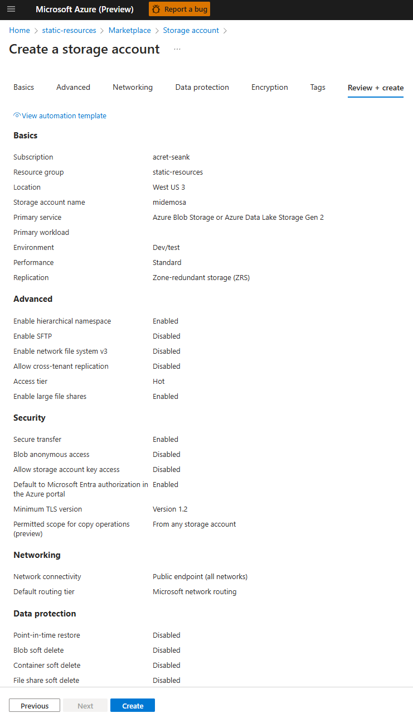

# azure-mi-demo

A quick demo app demonstrating using Azure MI complete with local auth example

## Impetus

Microsoft is requiring all Azure teams to use the Microsoft Identity platform.

OK, so the TSG ([Identity-Based Access for Storage Accounts | Azure Storage (eng.ms)](https://eng.ms/docs/products/azure-storage/security/standards/identity-based-access)) has a section for ```Above ARM``` with a link named [Managed Identity](https://eng.ms/docs/products/onecert-certificates-key-vault-and-dsms/key-vault-dsms/certandsecretmngmt/credfreewithmsi) that has a section named ```How to use managed identity``` with a link named [Access Azure Storage using a Windows VM system-assigned managed identity](https://learn.microsoft.com/en-us/entra/identity/managed-identities-azure-resources/tutorial-windows-managed-identities-vm-access?pivots=identity-windows-mi-vm-access-storage) which we are told to see for step-by-step instructions. In the ```Prerequisites``` section is a link named [overview](https://learn.microsoft.com/en-us/entra/identity/managed-identities-azure-resources/overview?source=docs) with a video! If you watch the video, at 12:25 Varun explains that the ```DefaultAzureCredential``` object gives you the flexibility to run code locally as well as deploy to Azure.
 
Unfortunately, the video does not give much more help but looking up the docs for [DefaultAzureCredential](https://learn.microsoft.com/en-us/dotnet/api/azure.identity.defaultazurecredential?view=azure-dotnet) in the ```Remarks``` section it mentions the ```InteractiveBrowserCredential```. This sounds to me like a solution that could work. I imagine it would do something like give you a URL in the console output to open in a browser and login with your ```@microsoft.com``` account, then use those credentials. This is a quick demo app to show how to use the new Microsoft Identity platform and still be able to run code locally for debugging.

## Setup

### Create Storage Account

1. Navigate to a resource group in the portal and click ```+Create```

    

2. Choose ```Storage account``` from the list

    

3. Fill in the Basics tab of the form with a unique name, and reasonable choices, and click ```Next```

    

4. Fill in the Advanced tab of the form with reasonable choices and click ```Next```

    _**Note:** If you don't uncheck ```Enable storage account key access```, you will need to change it after the storage account is created (we will show you how below)._

    

5. Fill in the Networking tab of the form with reasonable choices and click ```Next```

    

6. Fill in the Data protection tab of the form with reasonable choices and click ```Next```

    

7. Fill in the Encryption tab of the form with reasonable choices and click ```Next```

    

8. Fill in the Tags tab of the form with reasonable choices and click ```Next```

    

9. Check the settings in the Review + create tab of the form and click ```Create```

    

### Disable Shared Key Access

1. If you didn't unchecked ```Enable storage account key access``` in step 4, you will need to change it after the storage account is created. Click on the storage account you just created and click on ```Settings``` then ```Configuration``` in the left-hand menu. Click on ```Disabled``` for ```Allow storage account key access```

    

### Create a Managed Identity

1. Search for and click on ```Managed Identities``` in the portal

    

2. Click on ```+Create```

    

3. Choose a resource group, region, and name for the managed identity and click ```Review + create```

    

4. Click ```Create```

    

### Assign the Managed Identity to a role in the Storage Account

1. Click on the storage account you created earlier and click on ```Access control (IAM)``` in the left-hand menu. Click on ```+Add``` drop down and choose ```Add role assignment```

    

2. Search for ```storage account contributor``` and select it and press ```Next```.

    

3. Choose ```Managed Identity``` for the ```Assign access to``` field and clcik ```+Select members```. Select ```User-assigned managed identity``` and type the name of the managed identity you created earlier, select it and press ```Select```.

    

4. Optionally, you can add your user account to the role if you want to be able to access the storage account from your local machine. This may not be necessary if you are the owner of the subscription.

5. Then press ```Review + assign``` twice to create the role assignment.

    

## To Run locally

From the terminal run the follwing command:

```dos
az login --tenant 72f988bf-86f1-41af-91ab-2d7cd011db47 --use-device-code
```

This will give you a code to enter at [https://microsoft.com/devicelogin](https://microsoft.com/devicelogin) and then you can login with your ```@microsoft.com``` account.

Then run the following command:

```dos
dotnet run
```

## Notes

https://learn.microsoft.com/en-us/azure/storage/common/shared-key-authorization-prevent?tabs=portal

To create the sample from scratch, you can use the following commands:

```dos
md azure-mi-demo
cd azure-mi-demo
dotnet new console
dotnet add package Azure.Storage.Blobs
dotnet add package Azure.Identity
```